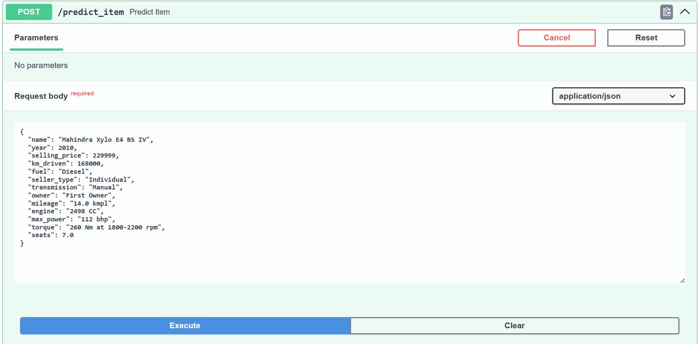
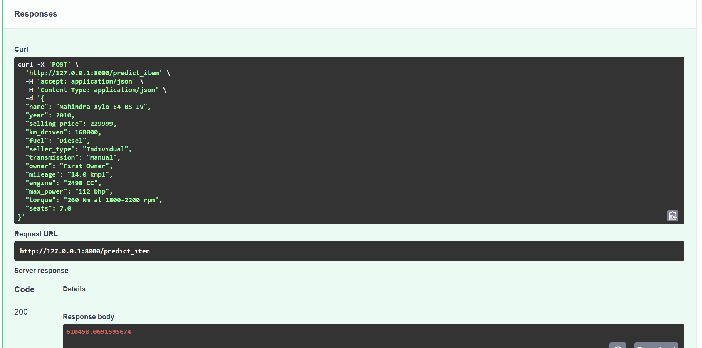
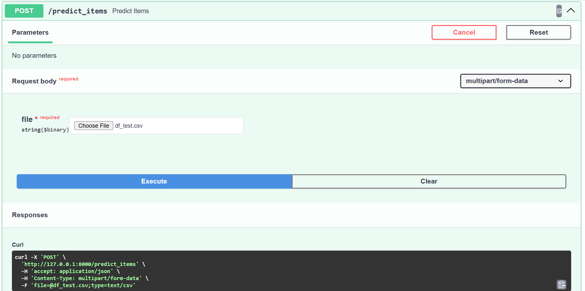
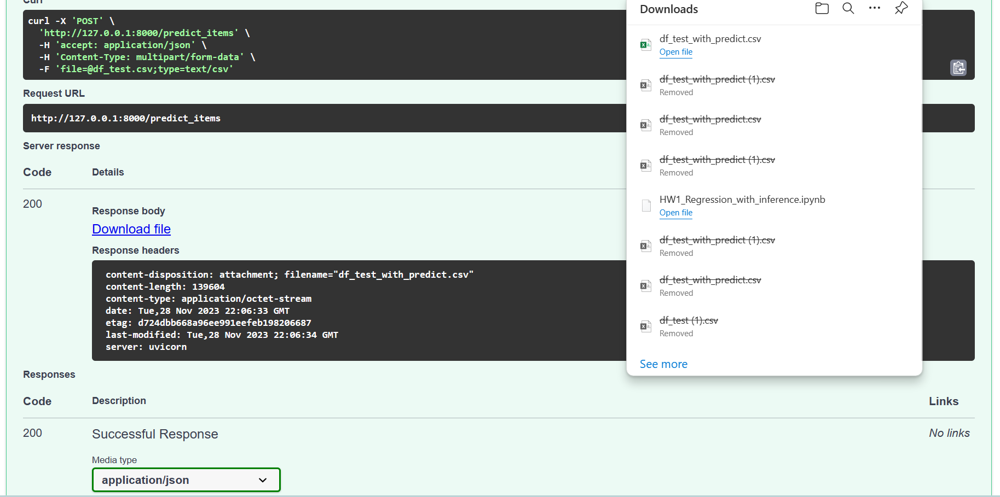

# car_price

## Основные файлы и ссылки

google colab - https://drive.google.com/file/d/1fz6LRPafiZzX4J-dBHOuXCY4gasWoMeg/view?usp=sharing
и в файле `HW1_Regression_with_inference.ipynb`.

Реализованный fastapi находится в `main.py`.

Файлы с весами модели как coef_, так и intercept_ находятся в файле `model_weights.pickle` (Веса для лучшей модели),
кроме этого в файле `encoder.pickle` находятся обученный OneHotEncoder, а файл `train_medians.pickle` имеет в себе словарь медиан тренировочных данных.

Ещё добавлен файл `requirements.txt` в котором прописаны используемые библиотеки (полезно для запуска сервера).

И файлы `df_test.csv`, `df_test_with_predict.csv` первый с тестовыми данными, которые можно передавать прям файлом в swagger, а второй это ответ, который был получен (c предсказанием), ответ был проверен в конце колаба.

## Выводы

### В ходе работы было сделано следующее:

#### Простейший EDA и обработка признаков

    1. Посмотрена размерность тренировочной и валидационной выборки.
    2. Проанализированы типы данных и нулевые значения в каждой из колонок.
    3. Проверены тренировочные данные на наличие дупликатов, после чего избавились от копий.
    4. Проанализированы и изменены данные в необычных столбцах (с измерениями, различными единицами измерения, с несколькими данными в одной таблице). От чего-то избавились, что-то переработали в один вид, что-то попытались предобработать, но по итогу выполнения мы отказались ('torque', 'max_torque_rpm').
    5. Заполнили пропуски медианными значениями из трейна.
    6. Привели некоторые столбцы к числовому значению и удостоверились, что всё сделано хорошо.

#### Визуализации

    1. Посторили попарные графики для каждых двух колонок (и трейн, и тест), после чего проанализировали их и нашли некоторые зависимости, которые нам смогли уже сказать о т каких значений больше зависит таргет.
    2. Построили heatmap по которой смогли увидеть корреляцию между признаками и целевой переменной.
    3. И построили график для наиболее скореллированных признаков.

#### Дополнительные визуализации

    1. Я решил добавить график с худшей корелляцией.
    2. Кроме этого добавил 4 графика наиболее скореллированных признаков с целевой переменной, где вполне можно видеть неплохую корелляцию.

#### Часть 2 | Модель только на вещественных признаках

    1. Мы отдельно записали целевую переменную и удалили все колонки, которые нельзя представить в види вещественного признака, то есть хотя бы неправильно так представлять, тут я и узнал, что начальная колонка 'torque' нам вообще не нужна, ведь проверка размерности, которая была там по умолчанию, говорила об этом.
    2. После чего я написал метод для вывода r2 и MSE на тренировочных и на валидационных данных, и сделал простейшую линейную модель, которая на r2 показала примерно 0.59.
    3. Затем нам предложили использовать preprocessing StandardScaler, который практически не изменил результат, посмотрел веса, и выяснилось, что max_power является самым влияющим на результат.
    4. Потом использовалась Lasso, но результат тоже не был сильно отличным.
    5. После этого нам предложили использовать GridSearchCV и найти лучшие коэффициенты, чтоб попробовать обнулить веса в модели Lasso, коэффициенты были найдены, но модель обучившись с ними дала хуже результат, чем когда-либо раньше, хоть и удалось занулить половину весов (получается мы сократили размерность вдвое, что даст буст по скорости, хоть и пожертвовали некоторой точностью).
    6. Затем мы нашли лучшие параметры для ElasticNet, но результат стал таким же, что и был в прошлом пункте.

#### Часть 3 | Добавляем категориальные фичи

    1. Создал новый датафрейм в котором отсутсвовали некоторве колонки (не нужные нам).
    2. С помощью OneHotEncoder разбили категориальные признаки на колонки с пропуском первого. (сделали так для трейна и теста)
    3. GridSearchCV нашли лучшие параметры для модели Ridge и обучили её на них, таким образом получив лучшее r2_score из всех ~ 0.65.

#### Часть Бизнесовая

    Просто посчитали какая часть машин была предсказана с ошибкой < 10% в любую из сторон, получился результат в 0.244.

#### Часть 5 | Реализация сервиса на FastAPI

    Проверить результаты можно в файле `main.py`, для запуска использовать `uvicorn main:app --reload` будет доступ на localhost с портом 8000, для более удобного использования рекомендую добавить `/docs` откроется сваггер
    Так вот я добавил 2 пути на получение данных как словаря для выдачи одного предсказания, так и для получения файла и возврат файла на скачивание (сделал именно с файлом, потому что показалось сложнее и интереснее, ведь так проще передать файл и найти нужные тебе данные прям в файле, а не пойми как).
    В обоих случаях я предобрабатывал данные на сохраненном из колаба encoder'е и делаю заполнение нулов, и вычленяю числовые значения для колонок с размерностями, а потом выдавал результат по уже обработанным данным.
    Разница была только в том, что для одного объекта я возвращал только его прогнозируемую цену, а для файла, я в датафрейм добавлял еще один столбец с предсказанием и возвращал уже на скачивание новый файл со всеми начальными данными, но + столбец предсказаний
    Затем я проверил в колабе предсказания из fastapi и те, что были на той обученной и предобработанной модели, ответ был точен на всех 1000 объектах с точностью до 5 знака после запятой, что считаю правильным ответом.

## Размышления

Были обработаны данные и получена модель с неплохими предсказательными способностями, не считая наличия самой модели, наибольшим бустом служило добавление катогориальных признаков, ведь для машин на самом деле достаточно важно какой ты по счету владелец, трансмиссия или тип топлива. Если я правильно понимал все направления калаба, то лучшая модель имела r2 ошибку ~ 0.65, что является неплохим результатом в такой регрессионной задаче с большим возможным разбросом результатов. Не удалось нормально предобработать колонку torque, там очень много видов записей, отступов и даже есть разные единицы измерения, по идее, если сделать хорошую обработку этой колонки и нормально разделить её, на них обучить тоже, то можем получить небольшой рост, ведь эти данные тоже должны влиять на результат (как помним torque хорошо кореллировало с целевой переменной). Ну и не получилось получиь лучше модель чем 0.65 на r2, возможно я что-то не так понял в задании, но вот получилась такая модель.

## Работа сервиса

Первая запись из тестового датафрейма

Файл `df_test.csv`

Результат можно видеть в файле, и в гугл калабе проверяю с обученной там моделькой.
